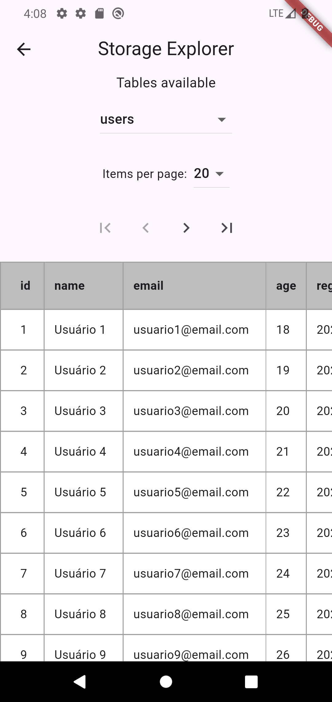

# Storage Explorer

A Flutter package for exploring and visualizing local SQLite databases during development.



## Features

- Visualize all database tables and their contents
- Paginated table data navigation
- Customizable page size
- Floating Action Button (FAB) integration
- **FAB only appears in debug mode** to avoid exposing data in production
- Works with SQLite databases created using packages like [sqflite](https://pub.dev/packages/sqflite) and [sqlite3](https://pub.dev/packages/sqlite3)

### Installation

Add the package to your `pubspec.yaml`:

```yaml
dependencies:
  storage_explorer: ^1.0.0
```

Run:
```bash
flutter pub get
```

## Usage

```dart
import 'package:flutter/material.dart';
import 'package:storage_explorer/storage_explorer.dart';

class MyApp extends StatelessWidget {
  @override
  Widget build(BuildContext context) {
    return MaterialApp(
      home: Scaffold(
        appBar: AppBar(title: Text('My App')),
        body: Center(child: Text('My App Content')),
        floatingActionButton: StorageExplorer(
          databasePath: 'path/to/your/database.db',
        ),
      ),
    );
  }
}
```